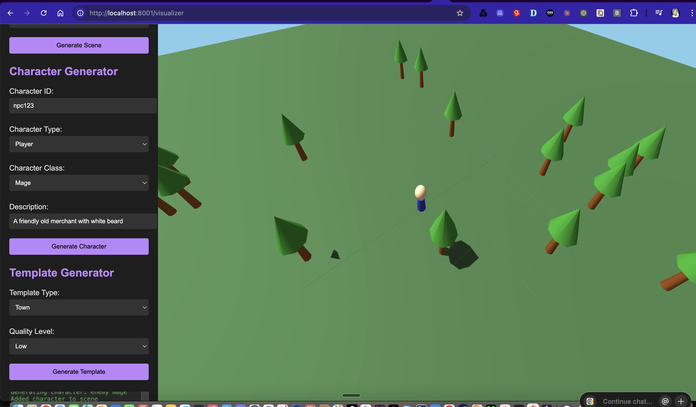

# Realm Forge 🏰✨

RealmForge is an advanced AI-driven procedural content generation system for game development. It leverages the AFLOW (Automated Flow) framework to dynamically create immersive game world elements including detailed 3D scenes, characters, compelling narratives, and interactive NPCs with unique personalities. By integrating AFLOW's graph-based workflows with 3D visualization, RealmForge enables developers to rapidly generate high-quality, consistent game content.

<div align="center">

[](https://www.python.org/downloads/)
[](https://fastapi.tiangolo.com/)
[](https://threejs.org/)
[](LICENSE)

</div>

## ✨ Features

- **🌳 Scene Generation** - Create rich, dynamic 3D environments with various settings (forests, towns, caves, dungeons)
- **👤 Character Generation** - Design detailed character models with customizable attributes and appearances
- **🤖 NPC Generation** - Develop non-player characters with unique personalities, behaviors, and backstories
- **🎮 Quest System** - Generate engaging quests with objectives, narratives, and rewards
- **🔄 Procedural Content** - Dynamically create game content that's different with each generation
- **🖥️ 3D Visualization** - View and interact with generated content in real-time using Three.js
- **🔌 RESTful API** - Comprehensive, well-documented API for seamless integration into game development pipelines

## 🚀 Getting Started

### Prerequisites

- Python 3.11+
- FastAPI
- Three.js (for visualization)

### Installation

1. Clone the repository:

```bash
git clone https://github.com/jmanhype/RealmForge.git
cd RealmForge
```

2. Install dependencies:

```bash
pip install -r requirements.txt
```

3. Set up environment variables (copy from example file):

```bash
cp .env.example .env
# Edit .env file to add your API keys and configuration
```

### Running the Server

```bash
python -m src.api.main
```

The server will start on http://localhost:8001

## 📚 API Documentation

Once the server is running, you can access the interactive API documentation at:

```
http://localhost:8001/docs
```

## 🎮 Visualization

The 3D visualization frontend is available at:

```
http://localhost:8001/visualizer
```


*Preview of the RealmForge 3D visualization interface with procedurally generated forest scene and character.*

## 🧪 Testing

To run the test suite:

```bash
pytest
```

## 🛠️ Development

RealmForge follows a modular architecture:

- `src/api` - FastAPI endpoints and server configuration
- `src/models` - Data models and schemas
- `src/services` - Business logic and AI integration
- `src/utils` - Helper functions and utilities
- `static` - Frontend assets for visualization

## 📋 Project Structure

```
RealmForge/
├── src/
│   ├── api/          # API endpoints and server
│   ├── models/       # Data models
│   ├── services/     # Business logic
│   └── utils/        # Utility functions
├── tests/            # Test suite
├── static/           # Frontend assets
├── .env.example      # Example environment file
├── pyproject.toml    # Project configuration
└── README.md         # This file
```

## 🗺️ Roadmap

RealmForge is actively being developed with the following roadmap:

### Current AFLOW Integration Status

- ✅ **Basic AFLOW Integration** - Core AFLOW workflows for content generation
- ✅ **Workflow Configuration** - Settings for narrative, world, NPC, and difficulty workflows
- ✅ **Optimization Pipeline** - Framework for workflow improvement based on user feedback
- ✅ **Multi-LLM Support** - Different LLM models for various generation tasks

### Short-term Goals (Q2-Q3 2025)

- 🔄 **Enhanced AFLOW Workflow Optimization** - Improve workflow performance based on user engagement metrics
- 🔄 **Custom AFLOW Operators** - Develop game-specific operators for specialized content generation
- 🔄 **Benchmark Suite** - Create game-specific benchmarks for evaluating content quality
- 🔄 **Performance Optimization** - Reduce latency and improve throughput for real-time game experiences
- 🔄 **OSA Gallery Integration** - Incorporate [Open Source Avatars Gallery](https://github.com/ToxSam/osa-gallery) for ready-to-use 3D characters
- 🔄 **CharacterStudio Integration** - Add [CharacterStudio](https://github.com/ToxSam/CharacterStudio) functionality for custom avatar creation

### Long-term Vision (Q4 2025+)

- 📅 **Expanded Content Types** - Add support for music, sound effects, animations, and more
- 📅 **User-friendly Workflow Editor** - GUI for designing and testing custom workflows
- 📅 **Community Workflow Repository** - Platform for sharing and discovering workflows
- 📅 **Advanced Integration Options** - Support for popular game engines (Unity, Unreal)
- 📅 **Distributed Generation** - Scale content generation across multiple servers
- 📅 **VRM Format Support** - Full implementation of the VRM avatar format for cross-platform compatibility
- 📅 **Advanced Avatar Customization** - Enhanced character creation with point-and-click building and texture editing
- 📅 **Avatar Optimization Pipeline** - Automatic mesh merging and texture atlassing for game-ready characters

### Planned External Integrations

#### OSA Gallery Integration

- Access to 300+ CC0 and open-source 3D avatars
- Support for VRM, FBX, and voxel formats
- VRM Inspector tool for analyzing and validating avatars
- Permanent avatar storage options
- Multilingual support for global accessibility

#### CharacterStudio Integration

- Web-based custom VRM avatar creation interface
- Drag-and-drop 3D files and textures
- Dynamic real-time animations for character previews
- VRM optimization tools (mesh merging, texture atlassing)
- Export capabilities for GLB and VRM formats
- Face auto-culling for performance optimization

## 📄 License

This project is licensed under the MIT License - see the [LICENSE](LICENSE) file for details.

## 🙏 Acknowledgments

- Built with [FastAPI](https://fastapi.tiangolo.com/) and [Three.js](https://threejs.org/)
- Uses [AFLOW](https://github.com/metagpt-ai/metagpt/tree/main/metagpt/ext/aflow) for AI workflow optimization
- Developed as part of the MetaGPT AFLOW project
- Integration plans with [OSA Gallery](https://github.com/ToxSam/osa-gallery) and [CharacterStudio](https://github.com/ToxSam/CharacterStudio) for enhanced avatar functionality

---

<div align="center">
  <p>Made with 💻 and ❤️ by the RealmForge Team</p>
</div>


*Preview of the RealmForge 3D visualization interface with procedurally generated forest scene and character.*

